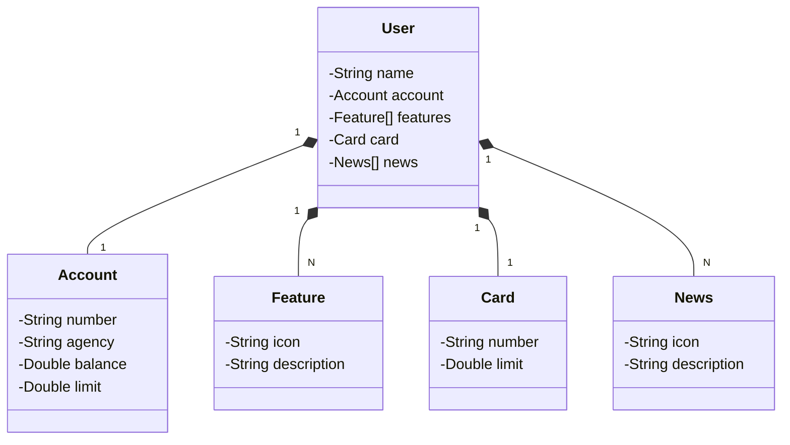

# API Challenge [DIO](www.dio.me)

RESTful API do Desafio do Bootcamp Santander 2023 construída em .Net 6.0.

Esta API é um projeto elaborado em C#, cuja a ideia original é do Tech Lead da DIO [Venilton](https://github.com/falvojr).

O projeto original é desenvolvida em Java e está disponível no [GitHub](https://github.com/digitalinnovationone/santander-dev-week-2023-api) da DIO.

O notebook para testar esta API, bem como o Pipeline ETL proposto para o desafio se encontra no [Colab Research Google](https://colab.research.google.com/drive/1jzCA-s-fhsf9GvZSEJl77xPGebn17mC3#scrollTo=Y8_axE7uMUSa)

## Principais Tecnologias
 - **.Net Core 6.0**: Utilizaremos a versão LTS do .Net Core para tirar vantagem das inovações que essa linguagem robusta e amplamente utilizada oferece;
 - **Entity Framework Core**: Exploraremos como essa ferramenta pode simplificar nossa camada de acesso aos dados, facilitando a integração com bancos de dados SQL utilizando todo potencial que a feature 'Migration' é capaz de oferecer;
 - **SQlite**: SQLite é uma biblioteca em processo que implementa um mecanismo de banco de dados SQL transacional independente, sem servidor e com configuração zero. 
 - **OpenAPI (Swagger)**: Vamos criar uma documentação de API eficaz e fácil de entender usando a OpenAPI (Swagger).
 - **Docker**: uma plataforma open source que facilita a criação e administração de ambientes isolados. Ele possibilita o empacotamento de uma aplicação ou ambiente dentro de um container, se tornando portátil para qualquer outro host que contenha o Docker instalado. Então, você consegue criar, implantar, copiar e migrar de um ambiente para outro com maior flexibilidade.
 - **Railway**: facilita o deploy e monitoramento de nossas soluções na nuvem, além de oferecer diversos bancos de dados como serviço e pipelines de CI/CD.

## Diagrama de Classes (Domínio da API)

## Documentação da API (Swagger)

## [https://api-challenge-dio-production.up.railway.app/swagger/index.html](https://api-challenge-dio-production.up.railway.app/swagger/index.html)

Esta API ficará disponível no Railway por um período de tempo limitado, mas este é um código-fonte aberto. Portanto, sintam-se à vontade para cloná-lo, modificá-lo e executar localmente ou onde achar mais interessante! 

### IMPORTANTE

- Essa API foi ela elaborada para fins educacionais. Considere seu uso em ambiente de produção.
- URL de Produção: https://api-challenge-dio-production.up.railway.app/swagger/index.html
